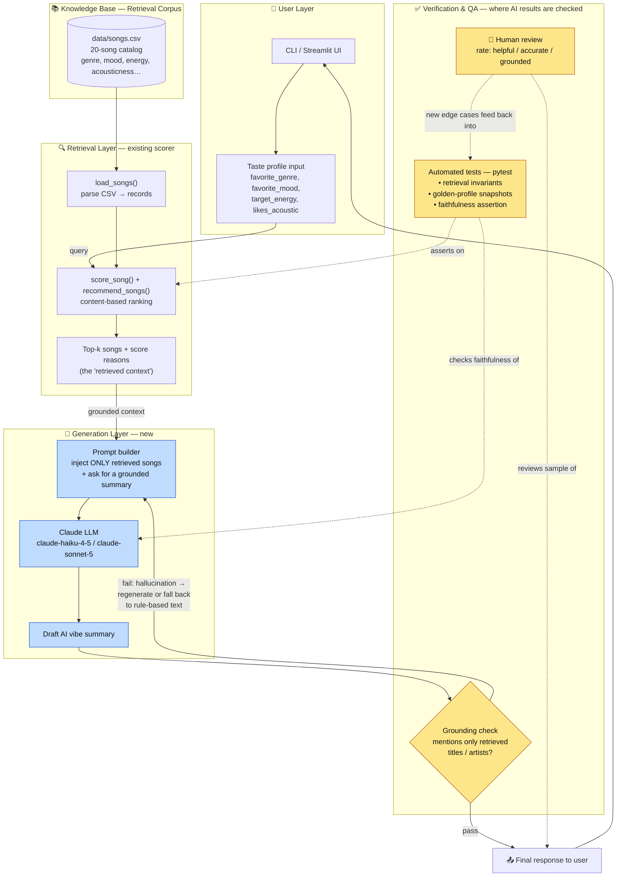

# VibeCheck — RAG Architecture

This document describes the planned Retrieval-Augmented Generation (RAG) design for
VibeCheck. The key idea: the existing content-based scorer **is** the retrieval half of
RAG. RAG adds a generation layer (Claude) that writes a natural-language "vibe summary"
**grounded only in the retrieved songs**, plus checks that guard against hallucination.

- **Amber** nodes = where AI results are checked (automated tests + human review).
- **Blue** nodes = new components to build.
- Everything else already exists in the project.

## Component legend

| Component | Status | Role |
|---|---|---|
| **User Layer** | exists | Collects the taste profile (the `UserProfile` fields). |
| **Knowledge Base** — `songs.csv` | exists | The retrieval corpus. The LLM may only reference these 20 songs. |
| **Retrieval Layer** — `score_song` / `recommend_songs` | exists | Ranks the catalog against the profile, returns top-k + score reasons. The "R" in RAG. |
| **Prompt builder** | new | Injects only the retrieved songs + scores into the prompt. Grounding = no hallucination. |
| **Claude LLM** | new | Generates the natural-language "why these fit your vibe" summary. |
| **Verification & QA** | new | Three checkpoints (below). |

## Where AI results get checked

1. **Grounding check (automated, per-request)** — before display, verify every song
   title/artist the LLM mentioned is in the retrieved set. On failure, regenerate or fall
   back to the rule-based explanation.
2. **Automated tests — pytest (offline/CI)** — retrieval invariants (scores ≤ 4.5, sorted,
   top-k correct) plus a faithfulness test over fixed "golden" profiles.
3. **Human-in-the-loop review (periodic)** — a person rates a sample of summaries; failures
   become new golden test cases (the feedback loop from `V3` back into `V2`).
